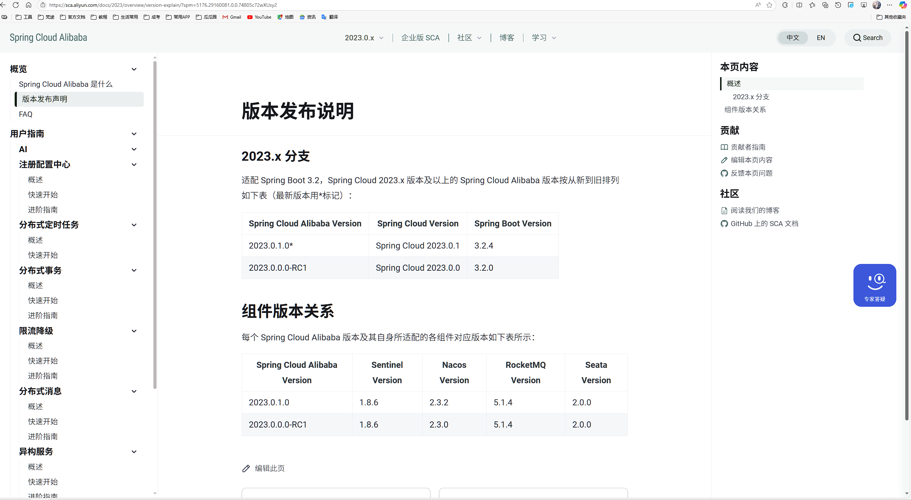

# boot-manage (bm 后台管理系统模板--cloud版)

## 一、项目介绍

## 二、架构图

## 三、项目结构

## 四、快速开始
### 环境要求
  * JDK : >= 17 (建议JDK 17)
  * Maven : 3.8.x
  * MySQL : 8.x.x
  * Redis : 8.x.x
  * Nacos : >= 2.3.2
  * Sentinel : >= 1.8.6 

### 启动项目
#### 配置中间件
  - 初始化数据库  
    创建数据库`bm`字符集`utf8mb4`排序规则`utf8mb4_general_ci`并导入 [doc/bm-initial-mysql.sql](doc/sql/bm-initial-mysql.sql)
  - 启动Redis  
  - 启动Nacos  
    导入nacos配置[doc/nacos/]()目录下的配置
  - 启动Sentinel (可选)
  - 启动Seata (可选)
  - 启动Zipkin (可选)
#### 修改配置
- nacos配置  
 修改`bm.yml` 中数据源、Redis 连接信息 
    ```yaml
    bm:
      # 安全配置
      security:
        # 跳过鉴权的uri路径
        skip-url:
         - /bm-example/**
         - /bm-websocket/**
         - /**/v3/api-docs
         - /**/v2/api-docs
         - /bm-auth/auth/login
         - /bm-auth/auth/refreshToken
         - /bm-datareport/ureport/**
         - /ureport/preview
         - /favicon.ico
         - /bm-auth/encryption/getEncryptionPublicKey
        token:
          # token密钥
          secret: "zuuzYao-bm.9d4c8b1e3f5d7a0b2c9d8e7f6a5b"
          # token前缀
          prefix: "Bearer "
        # 内部调用认证配置
        internal-valid:
          # 开启后服务调用只能由服务之间发起调用,外部不能调用! 适用于网关和服务都暴露在外网中情况
          enable: false
          # 认证令牌
          token: "bm-internal-token-zuuzYao-bm-Z2l0aHViLXp1dXVZYW8="
      # 定义数据源
      datasource:
        url: jdbc:mysql://127.0.0.1:3306/bm?useUnicode=true&characterEncoding=utf-8&serverTimezone=Asia/Shanghai
        username: root
        password: "123456"
      # redis数据源
      data:
        redis:
          host: 127.0.0.1
          port: 6379
          password: 
          database: 15
    ```
- 启动常量 [LauncherConstant.java](bm-common/src/main/java/org/github/bm/common/launch/LauncherConstant.java)  
    修改dev环境Nacos启动参数   
    Sentinel 、Seata 、Zipkin 等不是必要的如果用到则配置,不配置也不影响项目启动
    ```java
    public interface LauncherConstant {
        /**
         * nacos namespace id ,为空为public
         */
        String NACOS_NAMESPACE = "";
    
        /**
         * nacos dev 地址
         */
        String NACOS_DEV_ADDR = "127.0.0.1:8848";
    
        /**
         * nacos prod 地址
         */
        String NACOS_PROD_ADDR = "172.30.0.48:8848";
    
        /**
         * nacos test 地址
         */
        String NACOS_TEST_ADDR = "172.30.0.48:8848";
    
        /**
         * sentinel dev 地址
         */
        String SENTINEL_DEV_ADDR = "127.0.0.1:10810";
    
        /**
         * sentinel prod 地址
         */
        String SENTINEL_PROD_ADDR = "172.30.0.58:8858";
    
        /**
         * sentinel test 地址
         */
        String SENTINEL_TEST_ADDR = "172.30.0.58:8858";
    
        /**
         * zipkin dev 地址
         */
        String ZIPKIN_DEV_ADDR = "http://127.0.0.1:9411";
    
        /**
         * zipkin prod 地址
         */
        String ZIPKIN_PROD_ADDR = "http://172.30.0.58:9411";
    
        /**
         * zipkin test 地址
         */
        String ZIPKIN_TEST_ADDR = "http://172.30.0.58:9411";
    }
    
    ```
#### 启动服务
启动全部服务没有先后顺序
- 启动 网关服务`GateWayApplication`
- 启动 认证服务`AuthApplication`
- 启动 系统服务`SystemApplication`
- 启动 用户服务`UserApplication`
- 启动 资源服务`ResourceApplication`
- 启动 WebSocket服务`WebSocketApplication`
- 启动 Springboot监控服务`AdminApplication` 可选
- 启动 演示服务`ExampleApplication` 可选  


### 编译打包


###### SpringBoot、SpringCloud Alibaba、SpringCloud及组件[版本选择参考](https://sca.aliyun.com/docs/2023/overview/version-explain/)
