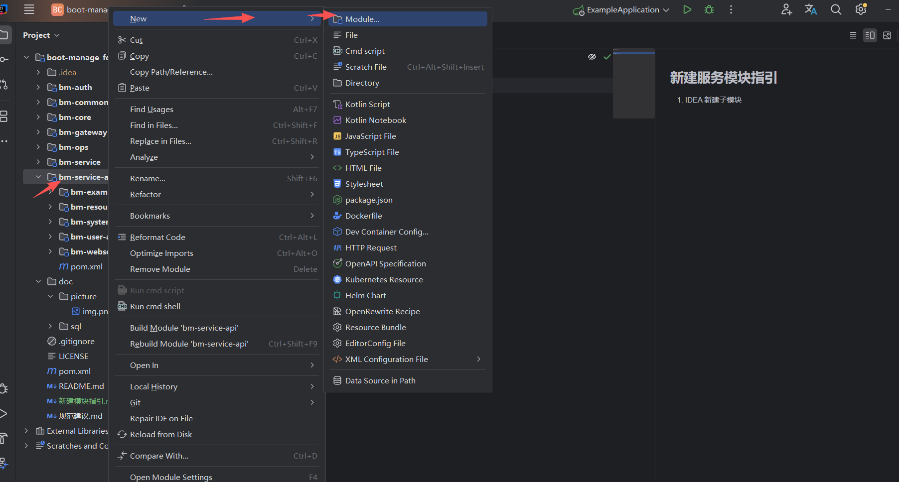
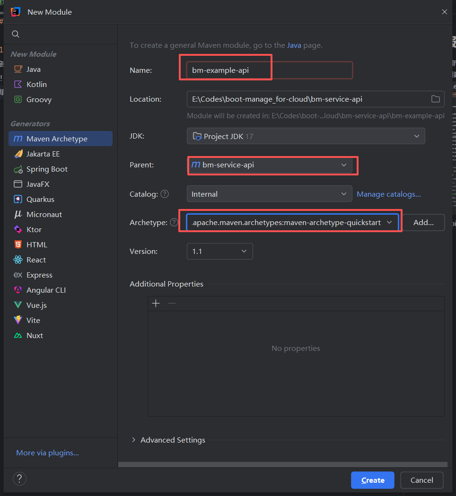
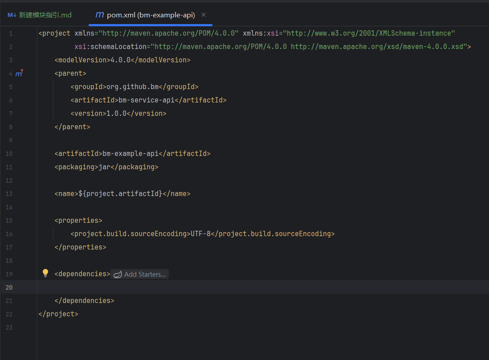
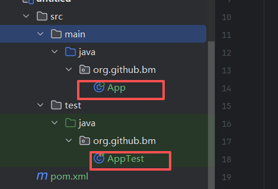
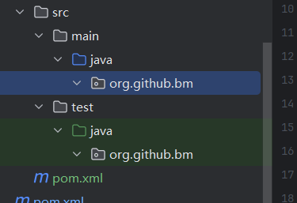
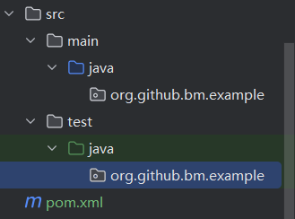
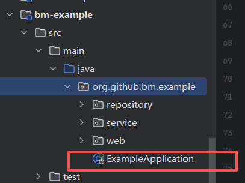
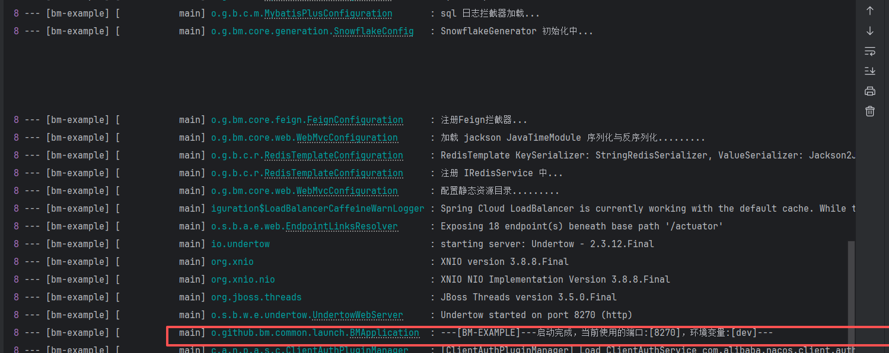

## 新建服务模块指引

### 1. IDEA 新建bm-service-api子模块    
- 首先创建api模块，选中父模块 `bm-service-api` 右键 `New` 创建 `Module` 模块 
  

- 填写api模块信息  
Name 填写 `bm-服务名-api`  
Parent 选择 `bm-service-api` 为父工程，如果没有自动选中则手动选择  
Archetype 选择 `quickstart` 其实用不到但是必须要选中一个,等创建完了删除相关文件  
填写完点击 `Create` 创建模块


- 删除maven项目模版的文件  
pom.xml 文件修改 `dependencies` 清空, `<name></name>` 填写 `<name>${project.artifactId}</name>`  
  
- 删除 `src/main/java` 、`src/test/java` 中的Java文件。只需要删除文件，不需要删除目录  
  
- 修改包名 添加服务名这一层级  
  修改前  
    
  修改后  
  

### 2. IDEA 新建bm-service子模块
操作和上面一样只是父模块不一样,这里就只指出不一样的地方
- 创建service模块，选中父模块 `bm-service` 右键 `New` 创建 `Module` 模块
- 填写service模块信息  
  Name 填写 `bm-服务名`  
  Parent 选择 `bm-service` 为父工程，如果没有自动选中则手动选择  
  Archetype 选择 `quickstart` 其实用不到但是必须要选中一个,等创建完了删除相关文件  
  填写完点击 `Create` 创建模块


### 3. 引入依赖
创建的 service 模块引入 api 模块
```xml
<project xmlns="http://maven.apache.org/POM/4.0.0" xmlns:xsi="http://www.w3.org/2001/XMLSchema-instance"
         xsi:schemaLocation="http://maven.apache.org/POM/4.0.0 http://maven.apache.org/xsd/maven-4.0.0.xsd">
    <modelVersion>4.0.0</modelVersion>
    <parent>
        <groupId>org.github.bm</groupId>
        <artifactId>bm-service</artifactId>
        <version>1.0.0</version>
    </parent>

    <artifactId>bm-example</artifactId>
    <packaging>jar</packaging>

    <name>${project.artifactId}</name>

    <properties>
        <project.build.sourceEncoding>UTF-8</project.build.sourceEncoding>
    </properties>

    <dependencies>
      <!--框架配置模块-->
        <dependency>
            <groupId>org.github.bm</groupId>
            <artifactId>bm-core</artifactId>
            <version>${bm-cloud.version}</version>
        </dependency>
      <!--该服务对应的api模块-->
        <dependency>
            <groupId>org.github.bm</groupId>
            <artifactId>bm-example-api</artifactId>
            <version>${bm-cloud.version}</version>
        </dependency>
    </dependencies>
</project>

```

### 4. 添加服务名常量和枚举
1. 在[AppConstant.java](bm-common/src/main/java/org/github/bm/common/constant/AppConstant.java) 新增常量
    ```java
        /**
         * 演示使用模块名称
         */
        String APPLICATION_EXAMPLE_NAME = AppConstant.APPLICATION_NAME_PREFIX + "example";
    ```
2. 在[ServiceEnum.java](bm-common/src/main/java/org/github/bm/common/constant/ServiceEnum.java) 新增枚举
    ```java
    /**
     * 演示模块枚举
     */
    APPLICATION_EXAMPLE(AppConstant.APPLICATION_EXAMPLE_NAME, "演示使用服务"),
    ;
    ```
### 5. 创建启动类
在service 模块下创建启动类


添加`@BMCloudApplication`注解  
使用`BMApplication启动器` 启动
```java
package org.github.bm.example;

import org.github.bm.common.constant.ServiceEnum;
import org.github.bm.common.launch.BMApplication;
import org.github.bm.core.annotations.BMCloudApplication;

/**
 * 备注：
 * 业务模块可以添加`bm-core`依赖，使用@BMCloudApplication来启动。会自动配置数据源、mybatis、redis、feign
 * 基础模块，如网关、监控模块等 ,不需要业务操作。就移除`bm-core`依赖使用 `@SpringBootApplication(scanBasePackages = {AppConstant.BASE_PACKAGES})` 来启动。可以参考 [bm-gateway]、[bm-admin] 模块
 */
@BMCloudApplication
public class ExampleApplication {
    public static void main(String[] args) {
        // 传入定义的服务名称
        BMApplication.run(ServiceEnum.APPLICATION_EXAMPLE.name, ExampleApplication.class, args);
    }
}

```

### 6. nacos中创建对应配置文件

创建对应配置文件 `bm-服务名.yml`  

如：bm-example.yml   

会导入bm.yml中的公用配置，这里就只指定一下端口就行

```yaml
server:
  port: 8270
```

### 7. 启动项目
经历以上配置就可以启动项目了  
控制台输出   
`` ---[BM-EXAMPLE]---启动完成，当前使用的端口:[xxx]，环境变量:[xxx]---``

